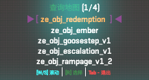
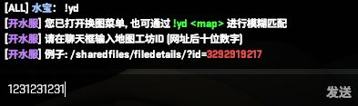
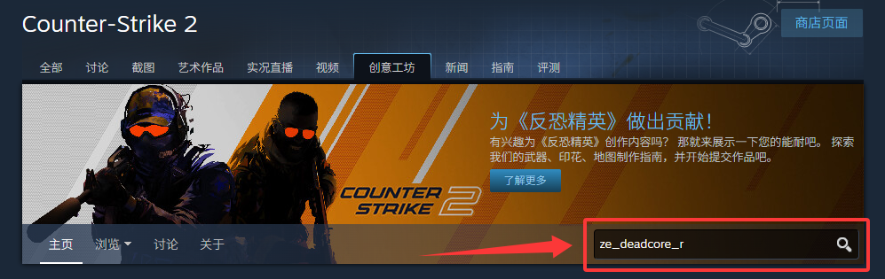
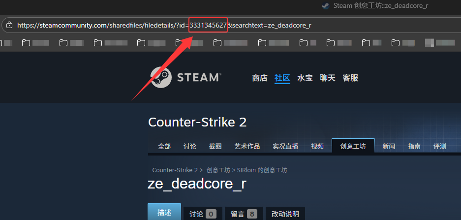

### 模糊匹配

1. 插件是支持模糊匹配的, 比如 <u>!yd obj</u>, 效果如下图, 是不需要一页页翻地图列表的.

---

### 更换训练地图

1. 首先进入为<u>训练服</u>的服务器 (群内/菜单内都会有标注)
2. 输入 <u>!yd</u> 打开地图列表, 地图列表内的所有地图均为有脚本的地图, 无脚本的地图不会出现在地图列表.

---

### 更换跑图地图

1. 首先进入为<u>跑图服</u>的服务器 (群内/菜单内都会有标注)
2. 输入 <u>!yd</u> 打开地图列表, 地图列表内的所有地图均为无脚本干预的地图

---

### 更换自定义地图

1. 若您发现在<u>跑图服</u>中, 没有在地图列表中找到您需要跑图的地图, 请使用<u>更换工坊地图</u>更换.
2. 只有服务器内首次更换过新图, 地图才会自动添加到地图列表, 后续可在地图列表中进行更换.

---

#### 方法如下

1. 选择更换工坊地图

2. 左下角聊天框输入地图工坊ID, 获取方式如下.

3. [点我打开链接](https://steamcommunity.com/app/730/workshop/), 然后输入需要查询的地图.

4. 点进您查询的地图

5. 这一串就是聊天框要输入的地图工坊ID

6. 确认更换即可, 需要稍等一会, 等待服务器下图即可, 若无反应多试几次.

